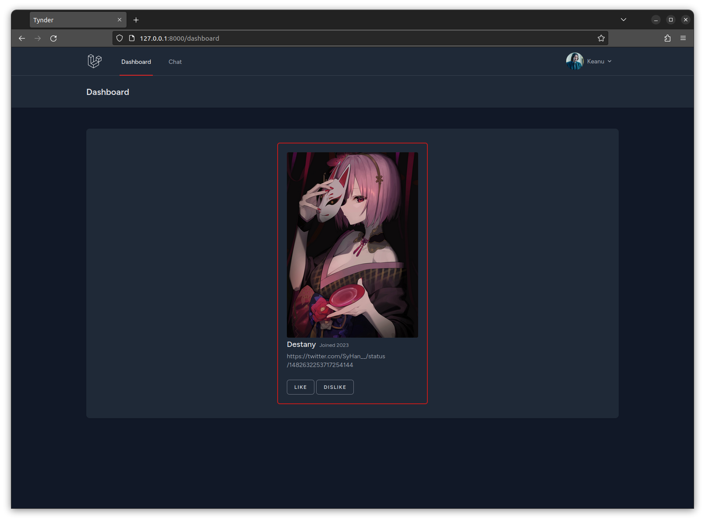

# Tynder

Tynder is a friend-making website that is based on the idea of connecting individuals from diverse backgrounds and cultures. It provides a platform where people can discover new connections and expand their social circle. The main goal of Tynder is to help users meet and connect with like-minded individuals who are eager to make new friends.

# Preview





# Dev Setup

1. Install Composer dependencies:

```sh
composer install
```

2. Install npm dependencies:

```sh
npm i
```

3. Create an **.env** file and copy **.env.example** contents into it, change database credentials if needed.

4. Create MySQL database:

```sql
CREATE DATABASE tynder;
```

5. Run database migrations:

```sh
php artisan migrate
```

6. Create application encryption key:

```sh
php artisan key:generate
```

7. Create storage symlink:

```sh
php artisan storage:link
```

8. Run database seeder:

```sh
php artisan db:seed
```

9. Serve:

```sh
php artisan serve
```

and simultaneously in another terminal:

```sh
npm run dev
```